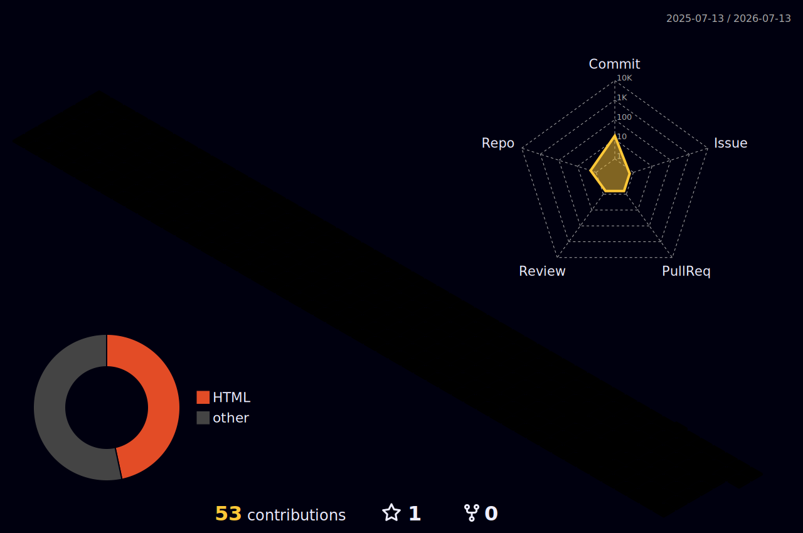

<!-- ===== HEADER ===== -->
<div align="center">


<br/><br/>

<a href="https://github.com/BLTCrowley">
  
</a>

<br/>


</div>

<br/>

<!-- ===== QUEM SOU EU ===== -->
## 👨‍💻 Quem sou eu?

```typescript
const crowley: Developer = {
  nome:     "Gabriel Zibas",
  cargo:    "Desenvolvedor Full-Stack & Engenheiro de IA",
  empresa:  "BS Manager",
  foco:     "Produtos de IA de ponta a ponta — da ideia ao deploy",
  stack: {
    linguagens:  ["TypeScript", "JavaScript", "Python"],
    frontend:    ["React", "Next.js", "Tailwind CSS"],
    backend:     ["Node.js", "Express", "FastAPI", "Laravel"],
    ia_llms:     ["Claude", "GPT", "Gemini", "DeepSeek", "MCP", "Agentes"],
    banco_dados: ["PostgreSQL", "Supabase", "MySQL"],
  },
  missao:   "Enviar coisas que funcionam de verdade e geram resultado ⚡",
};
```

<br/>

<!-- ===== SOBRE O TRABALHO ===== -->
## 🏗️ Sobre meu trabalho

- 🤖 **Integração de LLMs em produtos reais** — agentes, tool-calling, MCP e prompt engineering (Claude, GPT, Gemini, DeepSeek, Ollama)
- 💳 **SaaS de ponta a ponta** — pagamentos (Stripe), autenticação JWT + 2FA e automação de e-commerce
- 🧩 **Full-stack moderno** — Next.js/React no front, Node.js/Express e Python/FastAPI no back, deploy na Vercel
- ⚙️ **Automação** — scraping e fluxos com Puppeteer e pipelines multi-modelo de IA

<br/>

<!-- ===== STACK ===== -->
## 🛠️ Stack Tecnológica

<table>
<tr>
<td valign="top" width="58%">

**Linguagens**


**Frontend**


**Backend & APIs**


**IA & LLMs**


**Banco de Dados & Ferramentas**


</td>
<td valign="middle" width="42%" align="center">


</td>
</tr>
</table>

<br/>

<!-- ===== PROJETOS ===== -->
## 🔒 Projetos em destaque

> Repositórios **privados** — código confidencial.

| | Projeto | Descrição | Stack |
|---|---|---|---|
| 🏪 | **BS Manager** | SaaS para vendedores do Mercado Livre — créditos, pagamentos, 2FA e geração de criativos por IA | `Node` `PostgreSQL` `Stripe` `Gemini` |
| 🖼️ | **4x4SC / CasaAttract** | Gerador de fotos de produto com IA — pipeline multi-modelo | `Next.js` `OpenAI` `DeepSeek` `Gemini` |
| 🎙️ | **Falcon** | Assistente de voz estilo Jarvis com tool-use do Claude e MCP | `Python` `Claude` `STT/TTS` |

<br/>

<!-- ===== CERTIFICAÇÕES ===== -->
## 🎓 Certificações


<sub>Claude Code in Action · Building with the Claude API · Model Context Protocol (Intro + Advanced) · AI Fluency Framework · Agent Skills · Subagents · e mais.</sub>

<br/>

<!-- ===== STATS ===== -->
## 📊 GitHub Stats

<div align="center">


<br/>


</div>

<br/>

<!-- ===== SNAKE ===== -->
## 🐍 Contribuições

<div align="center">

</div>

<br/>

<!-- ===== 3D ===== -->
## 🗓️ Calendário de Contribuições 3D

<div align="center">

</div>

<br/>

<!-- ===== ACTIVITY ===== -->
## 📈 Gráfico de Atividade

<div align="center">

</div>

<!-- ===== FOOTER ===== -->

